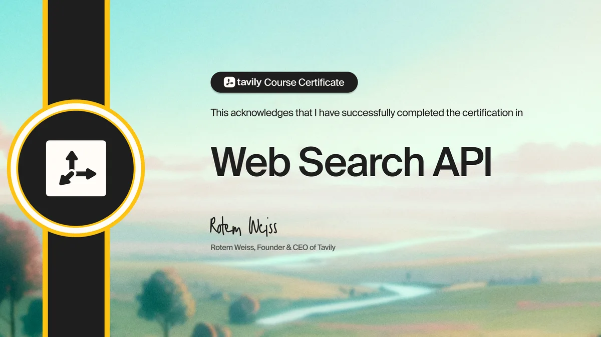

I finished Tavily's Web Search API certification the same week I finished this migration. That turned out to be a good order: the course mostly confirmed things I had just worked out the slow way.



## What the ingestion pipeline looked like before

The pipeline belongs to an entity-validation project at TransData. Before any of this, I had already owned a refactor that unified two duplicated AI-assisted validation flows into a single Python and MySQL pipeline. The client and the product are under NDA, so what follows is about the shape of the ingestion stage, not about whose data moves through it.

Ingestion had two stages, and only the first one was interesting.

**Discovery.** Serper returns search results for a query, which gives me a list of URLs worth reading. That part worked and still works.

**Retrieval.** Everything after the URL list was mine to own. Fetch each page, decide whether what came back was usable, pull the readable content out of it, handle the redirects, login walls and PDFs wearing an HTML content type, and back off politely per host so I did not get blocked.

None of those is hard. Together they are a maintenance surface that has nothing to do with the actual product, and each one carries a dependency. The slowest and least interesting stage of the pipeline was also the one most likely to break on a page shape I had not seen yet.

## What changed

Serper stayed. It is good at discovery and I had no reason to move it. Replacing the whole stack with one vendor is usually a worse decision than replacing one layer.

Tavily Extract took over retrieval: hand it URLs, get content back. Tavily Crawl covers the case where one URL should really become several, so I stopped writing my own link-following for that.

> [!NOTE]
> I did not benchmark the speed-up. A single batch I timed by hand came back noticeably faster, but one stopwatch reading is not a measurement, so I am not putting a number on it.

The part I am confident about is the part that is not a number: the retrieval stage stopped being code I maintain. Deleting a dependency you were only carrying to parse HTML is a real win even when you cannot put a clean figure on it.

## Checking credits on a provider that has no quota header

Tavily bills in credits. When it sits behind a registry of several metered providers, each with a priority, an enabled flag and timestamps for its last use, last error and exhaustion, the registry needs to know how much of each provider is left.

Most providers tell you in a response header. Tavily does not, so the quota check asks it directly:

```typescript
// Tavily exposes no quota header, but /usage is authoritative:
// plan_limit and plan_usage, not a guess.
const r = await fetch("https://api.tavily.com/usage", {
  headers: { Authorization: `Bearer ${key}` },
});
const { account } = await r.json();
return {
  remaining: account.plan_limit - account.plan_usage,
  allocated: account.plan_limit,
};
```

Two things I would tell anyone integrating it. The `/usage` call does not itself cost credits, so you can poll it without paying to find out what you have paid. And it returns the plan, so the check is authoritative rather than an estimate kept in your own config. When I checked it live on 5 August 2026 it reported the Researcher plan with a limit of 1,000.

That distinction matters more than it sounds. A hardcoded quota is a number that goes stale silently the first time a plan changes.

## What the certification actually covers

It is a course certificate, not a proctored exam, and it carries no credential ID. I would not present it as a qualification.

What it was genuinely good for is a map of the API surface. Tavily has four endpoints that are easy to conflate: Search when you need to find pages, Extract when you already have the URL, Crawl when one URL should become many, and Map when you want the shape of a site without the contents. Before the course I was defaulting to Search in places where I already had the URL, which is a wasted call and a wasted credit.

You can take it at [app.tavily.com/certification](https://app.tavily.com/certification). It is free and short.

## What I got wrong

I defaulted to the Search endpoint for pages I already had URLs for. It worked, so nothing flagged it, and every one of those calls spent a credit on discovery I did not need. The fix was trivial once I knew the endpoints apart. The lesson is that "it works" says nothing about whether it is the right call.

## What is still rough

- **I have not measured cost per record.** Credits per ingested record is the number that would tell me whether this was a good trade, and I have not run it.
- **Exhaustion is recorded, not handled.** The registry knows when a provider ran out. Falling over to the next one is still a manual decision, which is fine until it happens at 2am.
- **Crawl depth is guesswork.** I tuned it by looking at results, not by any principle. On a site with a different link structure I would be starting over.
- **The timing deserves a real benchmark.** I would rather publish a boring measured figure than an impressive remembered one.
